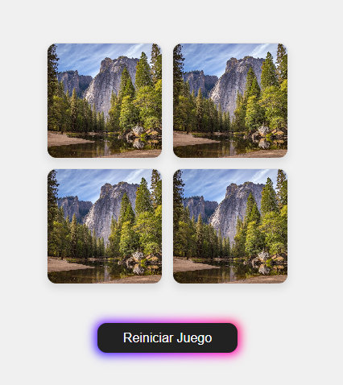
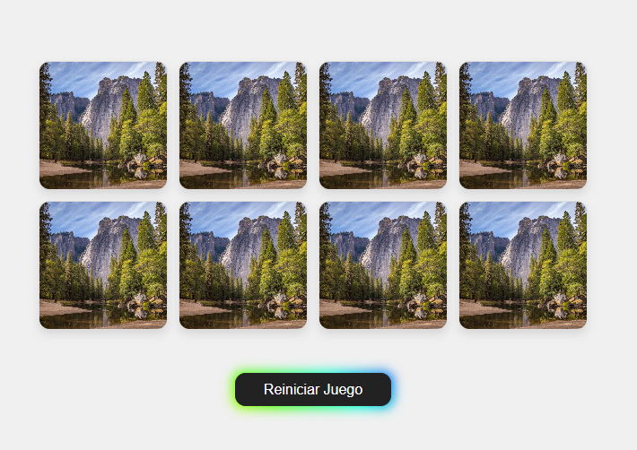

# 🧠 Juego de Memoria

Bienvenido al repositorio del Juego de Memoria, un divertido y desafiante juego para poner a prueba tu memoria 🎮. Este proyecto fue desarrollado como parte de un ejercicio para demostrar habilidades en HTML, CSS y JavaScript.

## 📜 Reglas del Juego

El objetivo del juego es encontrar todas las parejas de tarjetas lo más rápido posible. Aquí están las reglas:
- Tienes un conjunto de tarjetas dispuestas en un tablero.
- Cada tarjeta tiene un par que coincide.
- En cada turno, puedes voltear dos tarjetas para ver si coinciden.
- Si las tarjetas coinciden, se quedarán volteadas. ✅
- Si no coinciden, se volverán a voltear después de un breve momento. ❌
- El juego termina cuando todas las tarjetas han sido correctamente emparejadas. 🏁

## 💻 Tecnologías Utilizadas

Este proyecto utiliza las siguientes tecnologías:
- **HTML**: Estructura básica del juego.
- **CSS**: Diseño y estilos visuales del juego.
- **JavaScript**: Lógica del juego y manipulación del DOM.

## 🎲 Cómo Jugar

Para jugar, simplemente clona este repositorio y abre el archivo `index.html` en tu navegador.

A medida que vayas encontrando las parejas iras avanzando de niveles.

## 🔄 Reiniciar el Juego

Si en algún momento deseas comenzar de nuevo, puedes presionar el botón "Reiniciar Juego" que encontrarás debajo del tablero. ¡Esto te llevará de vuelta al nivel 1 y podrás intentar mejorar tu puntaje!

## 🤝 Contribuir

Si tienes sugerencias para mejorar el juego, no dudes en crear un 'pull request' o abrir un 'issue'. ¡Todas las ideas son bienvenidas!

## 📄 Licencia

Este proyecto está licenciado bajo [CC-BY-4.0](https://creativecommons.org/licenses/by/4.0/deed.es)

## 🙋 Autor

- [CarPeAs](https://github.com/CarPeAs)- *Desarrollo inicial*

## 🎉 Agradecimientos

- Agradecimientos a todos los que han contribuido con ideas y soporte.
